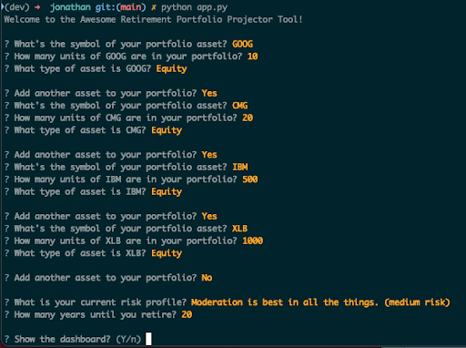

# Awesome Retirement Portfolio Projector Tool

The Awesome Retirement Portfolio Projector is a scalable, user friendly application that allows retail investors to do sophisticated predictive modeling for all phases of retirement.

After answering a series of profile questions, retail investors are able to receive a recommended portfolio and to run statistical simulation on stocks in this optimized recommended portfolio; and get a good estimate of their portfolios likely outcome over a specified time horizon. Simulations make use of historical pricing data from the Alpaca API. Simulations can be run for three different risk profiles - Low, Moderate, and High. Lower risk profiles have their portfolio rebalanced to include fixed income as a percent of the portfolio.

The application is a foundation that can be scaled to use a variety of input data sources, customizable expected returns, and limits on the allocation of individual assets. Profile questions can be modified to make a more detailed financial profile around common life scenarios such as debt, dependents, long term care, divorce, and multiple retirement income sources.

---

## Technologies

Built on Python, this application makes use of the following libraries:

- Fire
- Questionary
- Numpy
- Pandas
- Voila
- SciPy
- alpaca_trade_api
- sqlalchemy
- dotenv
- hvplot
- matplotlib

The Alpaca Trade api provides a variety of updated stock and financial information.

---

## Installation Guide

All python packages can be installed via PIP in the command line. For the Alpaca API, you will need to create and account and set up an API key at [Alpaca](https://alpaca.markets/)

---

## Examples

Here is a walk through example of a user who runs a portfolio simulation with a high risk tolerance.

Simply tell the app what stocks you have in your portfolio.

---

## Usage

To run the application, install the libraries listed above and run `python awesome_tool.py` from the command line.

The application will provide a recommended portfolio based on risk profile. The key elements for the recommendation are:

1) Assure diversification by using multiassets, including a set of diversified ETFs and Funds, that is easily customizable in the Jupyter Notebook.

2) Risk level will be controlled by managing the equity  allocation: 

- High Risk    :   75 - 90% 
- Moderate Risk:   40 - 60% 
- Low  Risk    :    5 - 20% 

3) Weights are optimized for a maximum Sharpe ratio.

The application then runs a Montecarlo simulation based on the historical pricing data of your portfolio:

The number of runs of the Montecarlo Simulation it has been set to 100 for a faster speed in the running of the program.
This is easible customizable in Jupyter lab for higher amounts, like 500 or 1000.

---

## Contributors

Written by fintech team: 

- Paola A. Carvajal Almeida [Linked In](https://www.linkedin.com/in/paolacarvajal/)
- Jonathan Woolsey [GitHub](https://github.com/woodedlawn)
- Abiy Mekuria [GitHub](https://github.com/Fishamekuria2019)
- Charles Twitchell [Linked In](https://www.linkedin.com/in/charlestwitchell/)

---

## License

GPU License
